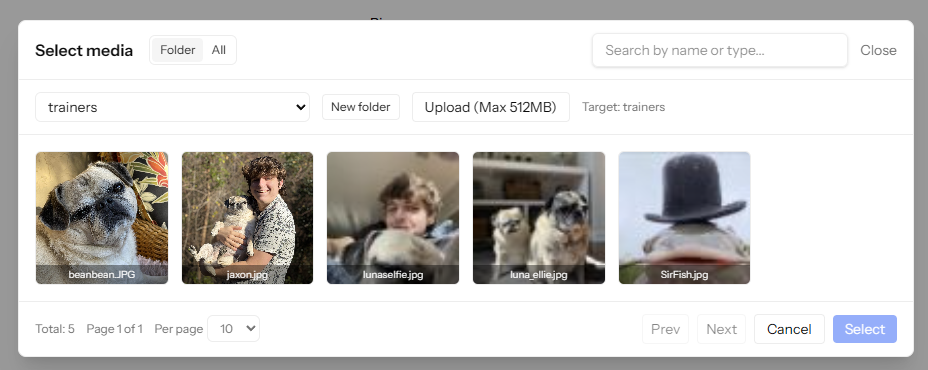

# J-Laravel Media Manager


Laravel media library with a Vue 3 picker modal, upload with duplicate detection, directory browsing, and safe thumbnailing. Designed to be installed via Composer and integrated into your existing Laravel app.



## Requirements
- PHP: ^8.1
- Laravel: ^10 | ^11 | ^12
- Intervention Image: ^2.7 | ^3.0
- Optional: spatie/laravel-permission (if you want role-based directory access)

## Quick start
1) Install the package
```
composer require jjdyo/j-laravel-media-manager
```

2) Publish assets, config, and migrations (choose any/all tags)
```
php artisan vendor:publish --provider="Jjdyo\MediaManager\MediaManagerServiceProvider" --tag=media-manager-config
php artisan vendor:publish --provider="Jjdyo\MediaManager\MediaManagerServiceProvider" --tag=media-manager-migrations
php artisan vendor:publish --provider="Jjdyo\MediaManager\MediaManagerServiceProvider" --tag=media-manager-assets
```

3) Configure environment (optional defaults shown)
Add to your `.env` (or keep defaults from the config file):
```
MEDIA_MAX_FILE_SIZE=5MB
MEDIA_ENFORCE_SPATIE=false
MEDIA_DISK=public
MEDIA_THUMB_MAX_PIXELS=40000000
MEDIA_THUMB_MAX_SIZE=20971520
```

4) Prepare storage and database
```
php artisan storage:link
php artisan migrate
```

5) Routes are auto-registered
This package loads its routes for you (behind `auth`).

6) Frontend build
- We publish Vue components and a small composable to `resources/js/vendor/media-manager`.
- Import the components into your app and build with Vite as usual.

Example import and usage:
```
// In a Vue page/component
<script setup lang="ts">
import MediaPicker from '@/vendor/media-manager/components/media/MediaPicker.vue'
function onMediaSelected(m) { /* save m.path, preview m.thumbnails_urls?.['256'] */ }
</script>

<template>
  <MediaPicker :context-dir="'trainers'" @select="onMediaSelected" />
  <!-- Ensure your layout includes: <meta name="csrf-token" content="{{ csrf_token() }}"> -->
  <!-- Access URLs: Storage::disk('public')->url($path) -->
</template>
```

## What you get
- Configurable directories (roots with labels) + dynamic subfolder scanning
- Optional role-guarded access per root (Spatie roles)
- Uploads with SHA‑256 duplicate detection (offers "use existing")
- Memory‑aware thumbnailing with safety limits (64px, 256px JPEG)
- Logs: dedupe hits, thumbnail preflight estimates, risk‑based skips, timings
- Folder creation with sanitized names and enforced nesting depth
- Vue 3 modal picker with Folder/All tabs, search, pagination, per‑page selector, upload with CSRF, duplicate handling

## Configuration
File: `config/media-manager.php` (after publish)
- `max_file_size` (e.g., `500KB`, `5MB`, `1GB`)
- `allowed_directories` (root keys with labels)
- `scan_depth` and `allowed_folder_nest`
- `thumbnails` (sizes as `[w,h,quality]`), `thumbnail_max_pixels`, `thumbnail_max_filesize_bytes`
- `disk`, `visibility`
- `enforce_spatie_permission` and per-root `permissions`

If you enable Spatie enforcement, only users with configured roles can use a root. Otherwise, any authenticated user can.

## Getting started in your app
1) Add the CSRF meta tag to your layout so uploads succeed:
```
<meta name="csrf-token" content="{{ csrf_token() }}">
```

2) Show the picker and save the selection in a form
```
<MediaPicker :context-dir="'logos'" @select="(m) => form.logo_path = m.path" />
```

3) Store the relative path and compute the public URL server-side
```
$url = Storage::disk('public')->url($model->logo_path);
```

See `USAGE.md` for full end-to-end examples (Trainer photo + Site logo), including validation rules and controller snippets.

## Testing the installation
Use this quick checklist to verify everything is wired correctly:
- Visit `/media` authenticated; directories load and pagination works
- Upload a large phone photo; a 256px thumbnail should appear and logs should show a thumbnail run
- Try uploading the same file again; you should see a duplicate detection flow
- Create a folder; name should be sanitized; depth limits respected
- If `MEDIA_ENFORCE_SPATIE=true`, ensure roles restrict roots as expected

## Frontend paths and Vite aliases
Assets are published to `resources/js/vendor/media-manager`. If your Vite alias `@` points to `resources/js`, then imports like `@/vendor/media-manager/components/media/MediaPicker.vue` will work. Adjust paths if your alias differs.

## Support & logging
Check `storage/logs/laravel.log` for detailed upload and thumbnail logs.

## License
MIT
